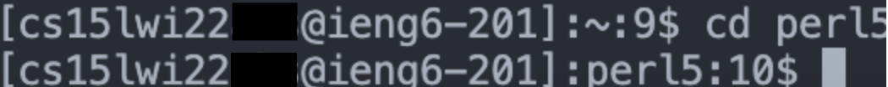
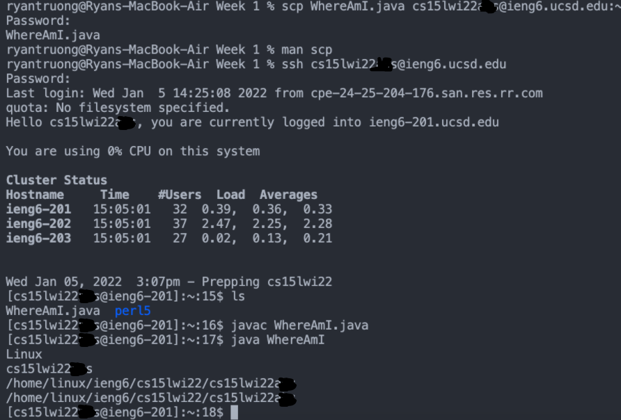

# Week 2 Lab Report: Remote Access
## *How to log onto course-specific account on* `ieng6`
---

[Back To Home](https://ryan-truong.github.io/cse15l-lab-reports/)

---

**Step 1: Installing VS Code**

* First visit [Visual Studio Code](https://code.visualstudio.com/) and follow the instructions to download the program
* After it is open, a successful install and opening of the program should like look the following screenshot

**Step 2: Remotely Connecting**
* First look up your course specific account for CSE15L [here](https://sdacs.ucsd.edu/~icc/index.php)
* Then under `Addional Accounts` you will see buttons that represent course specific accounts

    * The button labeled `cs15lwi22xxx` where `xxx` is replaced by your specific characters represents your account for this class and will be used to log in
    
        *Note: wi22 is subject to change for the quarter you take it in*
    
    * **IMPORTANT**: To successfully follow the next steps, you must change your password by clicking `change your password` and following the steps

* Now in VSCode, click on `Terminal` found at the top of the window, and then `New Terminal`
* Type into the Terminal that opens: `ssh cs15lwi22xxx@ieng6.ucsd.edu` where `cs15lwi22xxx` is your course specific account
* It will then ask you `Are you sure you want to continue connecting` type `Yes` and enter your `Password`
* If done sucessfully your terminal will look like the following screenshot

**Step 3: Trying Some Commands**

* Once connected to the remote server there are many commands to try! Here is a list of some commands that we tried

        cd - changes the directory
        cd ~ - changes to the home directory
        ls - list files
        ls -a - list all files
        cat <file> - prints out the contents of file

* A successful run of a command should like something like

**Step 4: Moving Files with** `scp`
* First we created a Java file on our computer called `WhereAmI.java` that prints out the name of our: OS, user, home, and directory
* We then used `scp` to securely copy files over from the *client* to the *server* in the following way (make sure you're logged out of the server by entering `exit` or pressing `Ctrl + D`):
        
        scp WhereAmI.java cs15lwi22zz@ieng6.ucsd.edu:~/

* Finally, we logged back into the server using `ssh`, compiled `WhereAmI.java` using `javac`, and then ran the program using `java`.
* The follow results were obtained

**Step 5: Setting an SSH key**

**Step 6: Optimize Remote Running**
