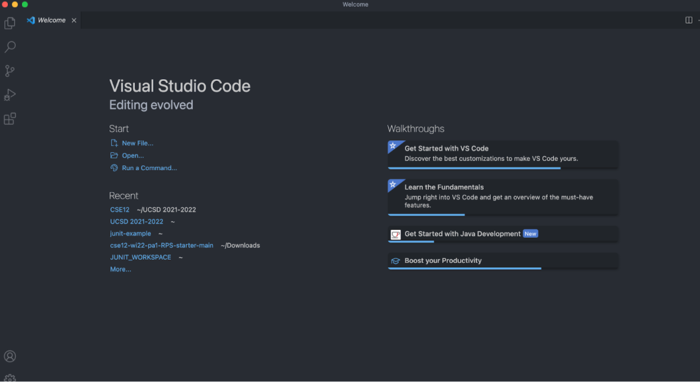
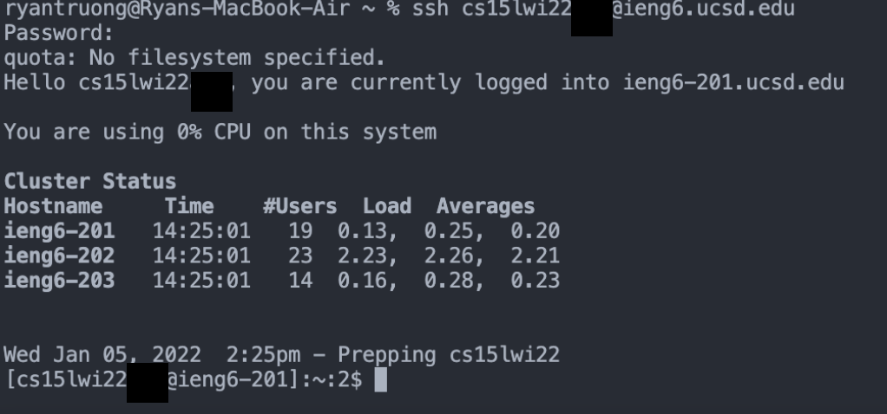
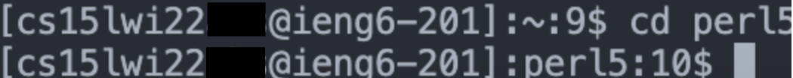
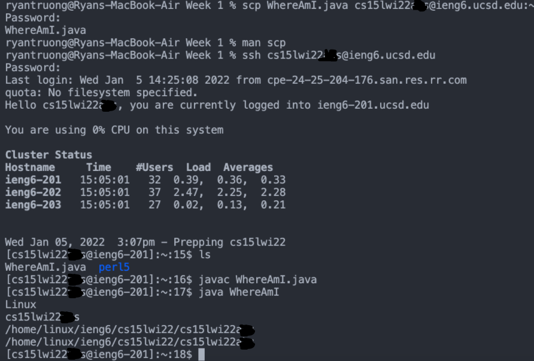
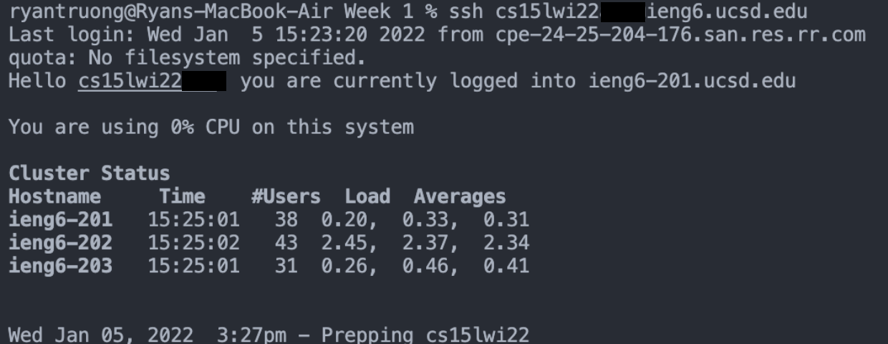
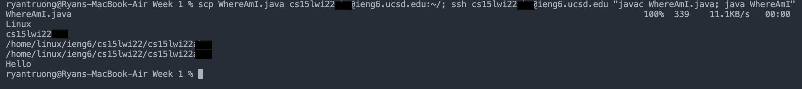

# Week 2 Lab Report: Remote Access
## *How to log onto course-specific account on* `ieng6`
---

[Back To Home](https://ryan-truong.github.io/cse15l-lab-reports/)

---


# **Step 1: Installing VS Code**

* First visit [Visual Studio Code](https://code.visualstudio.com/) and follow the instructions to download the program


* After it is opened, a successful install and opening of the program should like look the following screenshot



# **Step 2: Remotely Connecting**
* First look up your course specific account for CSE15L [here](https://sdacs.ucsd.edu/~icc/index.php)


* Then under `Addional Accounts` you will see buttons that represent course specific accounts

    * The button labeled `cs15lwi22xxx` where `xxx` is replaced by your specific characters represents your account for this class and will be used to log in
    
        *Note: wi22 is subject to change for the quarter you take it in*
    
    * **IMPORTANT**: To successfully follow the next steps, you must change your password by clicking `change your password` and following the steps

* Now in VSCode, click on `Terminal` found at the top of the window, and then `New Terminal`


* Type into the Terminal that opens: `ssh cs15lwi22xxx@ieng6.ucsd.edu` where `cs15lwi22xxx` is your course specific account


* It will then ask you `Are you sure you want to continue connecting` type `Yes` and enter your `Password`


* If done sucessfully your terminal will look like the following screenshot




# **Step 3: Trying Some Commands**

* Once connected to the remote server there are many commands to try! Here is a list of some commands that we tried

        cd - changes the directory
        cd ~ - changes to the home directory
        ls - list files
        ls -a - list all files
        cat <file> - prints out the contents of file

* A successful run of a command should like something like



# **Step 4: Moving Files with** `scp`
* First we created a Java file on our computer called `WhereAmI.java` that prints out the name of our: OS, user, home, and directory

````
class WhereAmI {
  public static void main(String[] args) {
    System.out.println(System.getProperty("os.name"));
    System.out.println(System.getProperty("user.name"));
    System.out.println(System.getProperty("user.home"));
    System.out.println(System.getProperty("user.dir"));
  }
}

````
* We then used `scp` to securely copy files over from the *client* to the *server* in the following way (make sure you're logged out of the server by entering `exit` or pressing `Ctrl + D`):
        
        scp WhereAmI.java cs15lwi22zz@ieng6.ucsd.edu:~/

* Finally, we logged back into the server using `ssh`, compiled `WhereAmI.java` using `javac`, and then ran the program using `java`.


* The follow results were obtained




# **Step 5: Setting an SSH key**
* To perform this step, type `ssh-keygen` in your *client*. It will then ask for a `passphrase`, which I left empty (just click `Enter` twice)


* A successful creation should show messages containing 
        
        Your identification has been saved in...
        Your public key has been saved in...
        The key fingerprint is: ...
* Once this step is complete ssh to log back into the server using `ssh cs15lwi22xxx@ieng6.ucsd.edu`. On the server you will first make a directory to store the key in by utilizing the command `mkdir .ssh`


* Log out of the server once this is complete and on the *client*, copy the **public key** into the *server's* `.ssh` directory you just created by using

        scp /Users/ryantruong/.ssh/id_rsa.pub cs15lwi22@ieng6.ucsd.edu:~/.ssh/authorized_keys

   * **IMPORTANT**: Replace `/Users/ryantruong/.ssh/id_rsa.pub` with the path that your public key was saved in (reference bullet point 2) and `cs15lwi22` with your account-specific user


* A successful implementation would cause you to not have to put your password in like so




# **Step 6: Optimize Remote Running**
* To optimize remote running, multiple commands can be typed on one line


* For example if we wanted to copy `WhereAmI.java` to the *server*, connected to the server, compile it, and then run it all in one command we can use 

        scp WhereAmI.java cs15lwi22xxx@ieng6.ucsd.edu:~/; ssh cs15lwi22xxx@ieng6.ucsd.edu "javac WhereAmI.java; java WhereAmI"

* To explain this, the semicolon after `scp WhereAmI.java cs15lwi22xxx@ieng6.ucsd.edu:~/` means after we copy to the server, we want to run another command, `ssh`. Then the quotation marks mean that after we connect to the server, we want to run a series of commands `javac` and `java`. Without the quotation marks, you can not run a series of commands after you `ssh`


* Successful implementation would look like so



* Keystrokes and time saved: Using the exact command line written in bullet 2, the total keystrokes/mouse clicks can be reduced to 10

        
        1 keystroke to use last command that was run: scp WhereAmI.java cs15lwi22xxx@ieng6.ucsd.edu:~/
        1 keystroke to type ;
        3 keystrokes/mouseclicks to copy and paste ssh cs15lwi22xxx@ieng6.ucsd.edu
        5 keystrokes to copy and paste "javac WhereAmI.java; java WhereAmI"

        
* Running this on a single line saves a significant amount of time because we do not have to wait for each line to execute before continuing. Especially for the `ssh` part, since we would have to `ssh` on every line we want to perform a single command like `javac`

