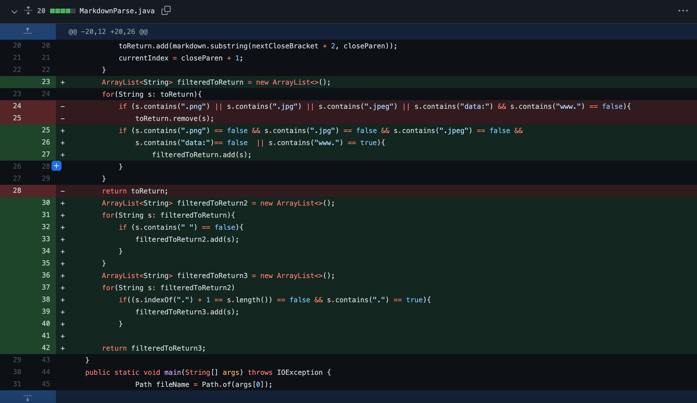
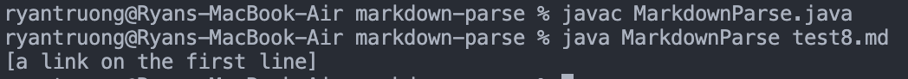

# Week 4 Lab Report: Bug Fixing
---
[Back To Home](https://ryan-truong.github.io/cse15l-lab-reports/)

---

# **First Code Change**
**Bug:** This code change attempted to fix the infite-loop bug that occurred when non-link text lines were added at the end of the file.

## Screenshot of Code Change


## Link to Failing Test File


[Failing Test File on GH](https://github.com/ryan-truong/markdown-parse/blob/f654b025656bd716269912381403a398678a33bc/test3.md)

Code within the linked file:
```
[Link](test.com)
[Link](test2.com)
[)
```

## Symptom Of the Failure Inducing Input


## Relationship Between the Bug, Symptom, and the Failure Inducing Input
* **Cause of Bug:** The bug in the code was an infinite while loop caused when there are lines at the end that are non-links. The reason why this bug appears is because the while loop only exits when the currentIndex is greater than the length of the string (lines of a file are taken in as a singular string) and currentIndex increments based on the value of closeParen. Because the end of the file doesn't contain all of the necessary characteristics for a link, the markers such as nextCloseBracket will become -1, and that causes the search for values like closeParen restart at the beginning of the string, in turn, never becoming greater than the length of the string.

* **Relationship:** The bug was not setting the parameters correctly to be able to exit the while loop and this was exposed by the input of putting non-link lines at the end of the file. When we tried to run the failure-inducing input file in the terminal, the symptom we saw was that the code kept continously running and we were stuck waiting for the code to execute, hinting to us that there was a bug in the code that caused it to infinitely run.

---
# **Second Code Change**
**Bug:** This code change attempted to fix the bug of returning links for images.

## Screenshot of Code Change


## Link to Failing Test File
[Failing Test File on GH](https://github.com/ryan-truong/markdown-parse/blob/be0005f905d56566c40a8ec6d230c4ba6244a062/test4.md)

Code within the linked file:
```
 [link](test.com)
```

## Symptom Of the Failure Inducing Input


## Relationship Between the Bug, Symptom, and the Failure Inducing Input
* **Cause of Bug:** Because the instructions explicitly state that we want to print non-image links, we found out that because images follow the same characteristics as links that our code checks for, our code prints out image files/links too. 

* **Relationship:** The bug was not filtering out the code for image files/links because the characteristics we utilized to check for links, are the same characteristics images contain. This bug was made apparent when we ran the failure inducing file (file that contained an image) and saw the symptom of the image file being printed out as well. Ultimately, the relationship between the three was that the failure inducing input showed us the specific symptom of printing image links, which showed that there was a bug in the code: the absence of filtering out image links.

---
# **Third Code Change**
**Bug:** Printed out everything stored in the parenthesis of a link `[]()` even if it wasn't a proper link.

## Screenshot of Code Change


## Link to Failing Test File
[Failing Test File on GH](https://github.com/ryan-truong/markdown-parse/blob/main/test8.md)

Code within the linked file:
```
[](a link on the first line)
[
```
## Symptom Of the Failure Inducing Input


## Relationship Between the Bug, Symptom, and the Failure Inducing Input
* **Cause of Bug:** Our code did not have any way of filtering what was inside the parenthesis of a markdown link. This meant that even if it wasn't a link, it would still be printed. 

* **Relationship:** The bug was that there was no filter that would check to see if the link stored in a markdown link (using `[]()`) was actually a valid link, thus whatever was stored inside would be printed no matter what. The failure inducing file that exposed this (written above) contains a non-link inside the parenthesis, and the symptom that resulted from that when running was that whatever was stored in between the parenthesis would print. Since the failure inducing file showed us a symptom that we didn't expect/want, it meant that there was a bug in our program, which overall was not checking if the links are valid.