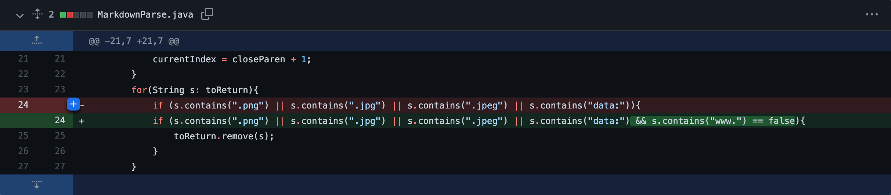

# Week 4 Lab Report: Bug Fixing
---
[Back To Home](https://ryan-truong.github.io/cse15l-lab-reports/)

---

# **First Code Change**
**Bug:** This code change attempted to fix the infite-loop bug that occurred when non-link text lines were added at the end of the file.

## Screenshot of Code Change


## Link to Failing Test File


[Failing Test File on GH](https://github.com/ryan-truong/markdown-parse/blob/f654b025656bd716269912381403a398678a33bc/test3.md)

Code within the linked file:
```
[Link](test.com)
[Link](test2.com)
[)
```

## Symptom Of the Failure Inducing Input


## Relationship Between the Bug, Symptom, and the Failure Inducing Input

---
# **Second Code Change**
**Bug:** This code change attempted to fix the bug of returning links for images.

## Screenshot of Code Change





## Link to Failing Test File
[Failing Test File on GH](https://github.com/ryan-truong/markdown-parse/blob/be0005f905d56566c40a8ec6d230c4ba6244a062/test4.md)

Code within the linked file:
```
 [link](test.com)
```

## Symptom Of the Failure Inducing Input


## Relationship Between the Bug, Symptom, and the Failure Inducing Input

---
# **Third Code Change**


## Screenshot of Code Change

## Link to Failing Test File

## Symptom Of the Failure Inducing Input

## Relationship Between the Bug, Symptom, and the Failure Inducing Input