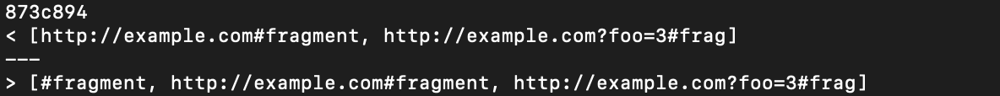
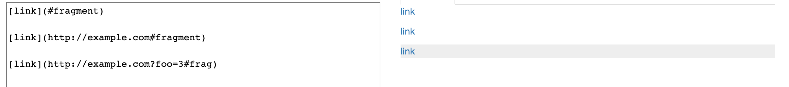
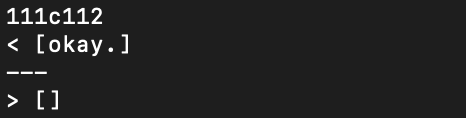
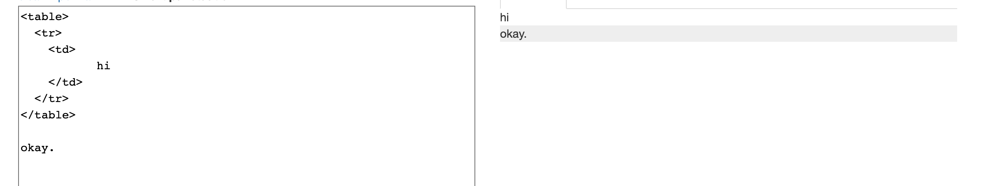

# Week 8 Lab Report: MarkdownParse Tests
---
[Back To Home](https://ryan-truong.github.io/cse15l-lab-reports/)

---

[Link to Our Group's MarkdownParse Repo](https://github.com/ryan-truong/markdown-parse-new)

---

# How Test With Different Results Were Found
* To find the tests which had different results, we first had to run `java MarkdownParse` on all 652 commonmark-spec tests for each version of MarkdownParse. 
* To do so, we used the bash file given, `script.sh`, which used a for each loop that iterated through all the test files and ran `java MarkdownParse $file` where `$file` was the specific test file. 

```
script.sh

for file in test-files/*.md;
do
    echo $file
    java MarkdownParse $file
done
```

* On the command line, the actual command we used was `bash script.sh > results.txt`. This made it so we had a place to store all the outputs of running `java MarkdownParse` on each test file.

* We ran the command above using our version of MarkdownParse and the CSE15L MarkdownParse and to compare the results, I used `diff results.txt ~lab9/markdown-parse/result.txt`.

**NOTE:** Each implementation of MarkdownParse was stored in a different directory. So in this context, `results.txt` refers to using our group's implementation, while `~lab9/markdown-parse/result.txt` is the CSE15L implementation.

* After `diff` showed which lines in `result.txt` had different results, I used `vim result.txt` to find that result and see which specific test file it corresponded to (since we used `echo $file` in the script).

# Test 1

## The Output and Test File


* Our implementation gave: `[http://example.com#fragment, http://example.com?foo=3#frag]`
* The CSE15L implementation gave: `[#fragment, http://example.com#fragment, http://example.com?foo=3#frag]`
* This tested `500.md`, which is shown below:

```
500.md

[link](#fragment)

[link](http://example.com#fragment)

[link](http://example.com?foo=3#frag)

```

## Expected Output/Correctness


* Based on the output from Commonmark, all inputs are valid links, so our implentation does not parse this file correctly because we didn't parse `#fragment`, while the given CSE15L implementation does.

## Explanation of the Bug


# Test 2

## The Output and Test File


* Our implementation gave: `[okay.]`
* The CSE15L implementation gave: `[]`
* This tested `149.md`, which is shown below:

```
149.md

<table>
  <tr>
    <td>
           hi
    </td>
  </tr>
</table>

okay.
```
## Expected Output/Correctness


* Based on the output from Commonmark, there are no links within this file, so nothing should be parsed. This means that our version of MarkdownParse parses this file incorrectly because we parsed `okay.`, while the given CSE15L MarkdownParse parses it correctly when returning nothing, `[]`.


## Explanation of the Bug